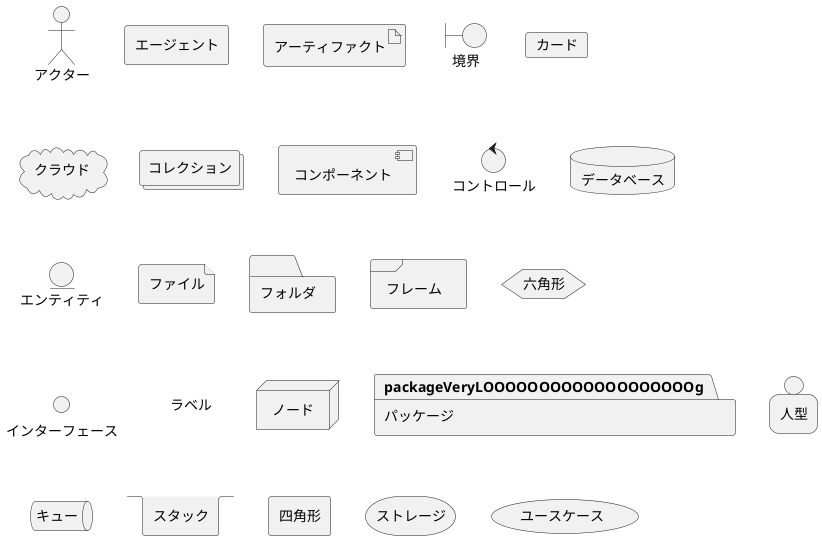

# About

## 概要
- これは MkDocs のサンプルページです。

```plantuml
@startuml
actor       actorVeryLOOOOOOOOOOOOOOOOOOOg       as "アクター"
agent       agentVeryLOOOOOOOOOOOOOOOOOOOg       as "エージェント"
artifact    artifactVeryLOOOOOOOOOOOOOOOOOOOg    as "アーティファクト"
boundary    boundaryVeryLOOOOOOOOOOOOOOOOOOOg    as "境界"
card        cardVeryLOOOOOOOOOOOOOOOOOOOg        as "カード"
cloud       cloudVeryLOOOOOOOOOOOOOOOOOOOg       as "クラウド"
collections collectionsVeryLOOOOOOOOOOOOOOOOOOOg as "コレクション"
component   componentVeryLOOOOOOOOOOOOOOOOOOOg   as "コンポーネント"
control     controlVeryLOOOOOOOOOOOOOOOOOOOg     as "コントロール"
database    databaseVeryLOOOOOOOOOOOOOOOOOOOg    as "データベース"
entity      entityVeryLOOOOOOOOOOOOOOOOOOOg      as "エンティティ"
file        fileVeryLOOOOOOOOOOOOOOOOOOOg        as "ファイル"
folder      folderVeryLOOOOOOOOOOOOOOOOOOOg      as "フォルダ"
frame       frameVeryLOOOOOOOOOOOOOOOOOOOg       as "フレーム"
hexagon     hexagonVeryLOOOOOOOOOOOOOOOOOOOg     as "六角形"
interface   interfaceVeryLOOOOOOOOOOOOOOOOOOOg   as "インターフェース"
label       labelVeryLOOOOOOOOOOOOOOOOOOOg       as "ラベル"
node        nodeVeryLOOOOOOOOOOOOOOOOOOOg        as "ノード"
package     packageVeryLOOOOOOOOOOOOOOOOOOOg     as "パッケージ"
person      personVeryLOOOOOOOOOOOOOOOOOOOg      as "人型"
queue       queueVeryLOOOOOOOOOOOOOOOOOOOg       as "キュー"
stack       stackVeryLOOOOOOOOOOOOOOOOOOOg       as "スタック"
rectangle   rectangleVeryLOOOOOOOOOOOOOOOOOOOg   as "四角形"
storage     storageVeryLOOOOOOOOOOOOOOOOOOOg     as "ストレージ"
usecase     usecaseVeryLOOOOOOOOOOOOOOOOOOOg     as "ユースケース"
@enduml
```